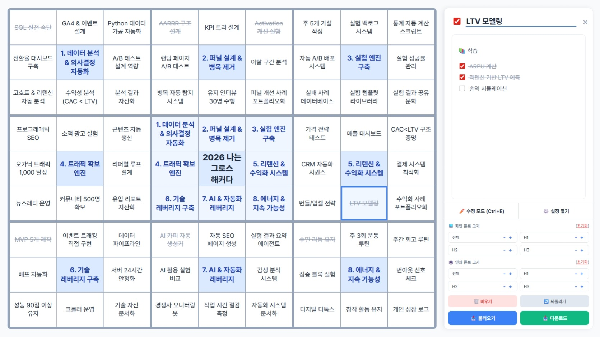
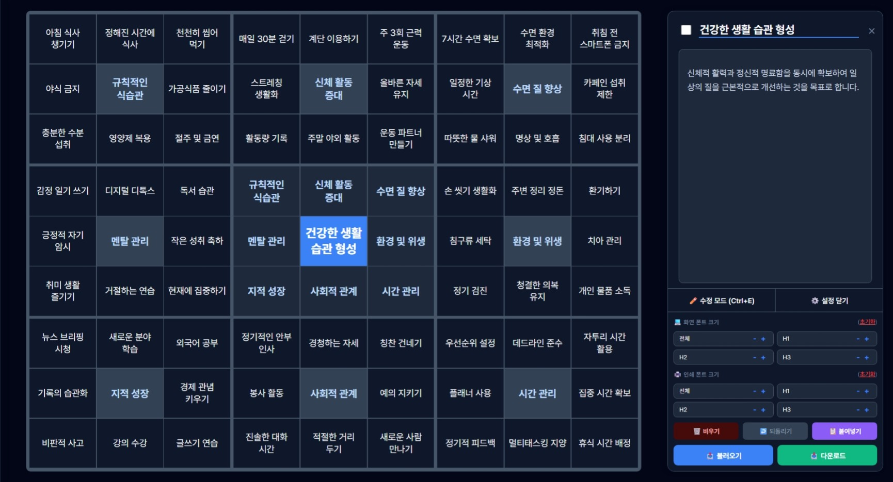

# 만다라트 제작기

| 
 | 
 |
| :--- | :--- |

웹 브라우저에서 즉시 실행 가능한 **만다라트 제작기**입니다.
복잡한 설치 없이 html 파일 하나만으로 동작하며, 마크다운 에디터와 로컬 스토리지 자동 저장 기능을 제공합니다.

## 주요 기능

- **설치 불필요 (Zero Setup)**: 다운로드 후 브라우저에서 파일을 열기만 하면 즉시 사용할 수 있습니다.
- **마크다운 기반 세부 계획**: 각 셀마다 마크다운 문법으로 세부 목표를 작성할 수 있습니다. 
- **인터랙티브 체크박스**: 읽기 모드에서 체크박스(`[ ]`, `[x]`)를 클릭하면 원본 마크다운 데이터가 실시간으로 동기화됩니다.
- **다크 모드 지원**: 사용자 눈의 피로를 덜어주는 라이트/다크 테마 전환 기능을 제공합니다.
- **영속성 및 파일 관리**: 작성한 모든 내용은 브라우저의 `localStorage`에 자동 저장됩니다. 언제든 `.md` 파일로 백업(다운로드)하거나 불러올 수 있습니다.
- **프린트 최적화**: 인쇄(`Ctrl + P`) 시 불필요한 UI(버튼, 패널)가 자동으로 숨겨지며, A4 가로 사이즈에 맞춰 만다라트 표만 깔끔하게 출력됩니다.
- **디테일한 폰트 제어**: 화면 렌더링용 폰트와 인쇄용 폰트 크기를 개별적으로 커스터마이징할 수 있습니다.
- **스마트 인쇄 및 PDF 저장**: 별도의 설정 없이도 Ctrl + P만 누르면 A4 용지 가로 방향에 딱 맞게 그리드가 배치됩니다.

## 사용 가이드

### ⌨️ 마우스 & 단축키 제어
* **셀 더블클릭**: 그리드 화면에서 즉시 목표의 제목을 수정합니다.
* **셀 원클릭**: 사이드 패널을 열어 세부 내용(마크다운)을 확인하고 편집합니다.
* `Ctrl + E`: 사이드 패널이 열려있을 때 읽기/수정 모드를 빠르게 전환합니다.
* `ESC`: 열려있는 사이드 패널을 닫습니다.

### 📝 마크다운 데이터 구조
만다라트 데이터는 직관적인 헤딩 레벨(`#`)을 통해 구조화됩니다. 외부 에디터에서 작성 후 `.md` 파일로 불러올 때 아래의 포맷을 따릅니다. 제목 앞에 `✅ ` 이모지를 붙이면 완료 처리된 셀로 인식합니다.
